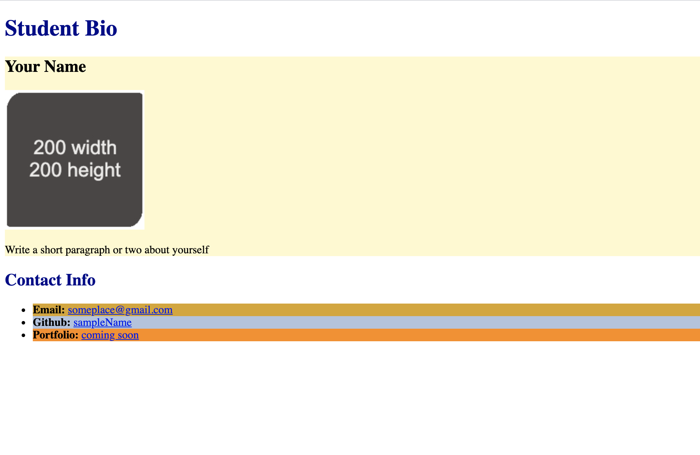

# ✅🏗️ Add Global Attributes to HTML Elements for Use With CSS

Work with a partner to implement the following user story:

- As a developer, I want to add global attributes to my HTML elements so that I can add styling with CSS.

## Acceptance Criteria

- ✅ It's done when the `<section>` elements are given a class attribute with a value of `lesson`.

- ✅ It's done when the email list item is given a unique identifier attribute with a value of `email`.

- ✅ It's done when the GitHub list item is given a unique identifier attribute with a value of `github`.

- ✅ It's done when the portfolio list item is given a unique identifier attribute with a value of `portfolio`.

- ✅ It's done when the existing image's `src` attribute specifies the relative path to the `image-1.jpg` file found in the `assets` directory and the `alt` attribute describes the image.

- ✅ It's done when the finished page matches the mockup.

## Assets

The following image demonstrates the web application's appearance and functionality:

---

## 💡 Hints

Why is it important that each global attribute is given a unique name?

## 🏆 Bonus

If you have completed this activity, work through the following challenge with your partner to further your knowledge:

- What other attributes can be used with HTML elements?

Use [Google](https://www.google.com) or another search engine to research this.

---

© 2023 edX Boot Camps LLC. Confidential and Proprietary. All Rights Reserved.
